# Nightingale 🏥 — Hospital Management App

A mobile-based software system designed to digitize and automate hospital operations. Built natively on **Android** using **Kotlin** and **Jetpack Compose (Material 3)** with **Firebase** cloud backend.

---

## 👥 User Roles & Key Features

*   **🛡️ Admin**: Manage doctor profiles, allocate beds, schedule operating theaters (OT), handle patient admissions, manage diagnostic test bookings, and view system reports & analytics.
*   **🩺 Doctor**: Manage appointment availability slots, view patient medical history, write digital prescriptions, check pharmacy inventory, and request surgeries.
*   **👤 Patient**: Browse departments, book appointments, access prescriptions, view diagnostic test results, and check medicine availability.

---

## 🛠️ Tech Stack & Database

*   **Platform**: Android (Min SDK: 24, Target SDK: 36) | **Language**: Kotlin
*   **UI**: Jetpack Compose (Material 3) | **Architecture**: MVVM with Coroutines & Flow
*   **Backend**: Firebase (Auth, Firestore, Cloud Messaging, Analytics)
*   **Firestore Collections**: `users`, `doctors`, `patients`, `departments`, `beds`, `operation_theatres`, `appointments`, `prescriptions`, `medicine`, `test_bookings`, `test_results`, `surgery_bookings`, `notifications`, `admissions`, `diagnostic_tests`

---

## 🚀 Quick Setup

1.  **Clone repo** and open in Android Studio.
2.  **Firebase Setup**: Create a project in [Firebase Console](https://console.firebase.google.com/), add package `com.example.nightingalehospitalapp`, download `google-services.json`, and place it in the `app/` folder (`app/google-services.json`).
3.  **Enable Services**: Turn on **Email/Password Auth** and **Cloud Firestore**.
4.  **Sync & Run**: Sync Gradle in Android Studio and run on an emulator or Android device (Android 8.0+).

---

## 📸 App Workflows & Screenshots

### 1. Onboarding & Authentication Flow
**Workflow Description**:
1. First-time users navigate through an interactive **Onboarding Tour** highlighting app features.
2. Users access the main gateway screen to **Log in** or **Register**.
3. During registration, users choose their role (**Patient** or **Doctor**). Doctor registrations require entering professional details (Specialization, Qualification, Department) and await admin approval before access is granted.

| Slide 1: Bookings | Slide 2: Health Records | Slide 3: Pharmacy Check | Slide 4: Fast & Reliable |
| :---: | :---: | :---: | :---: |
| 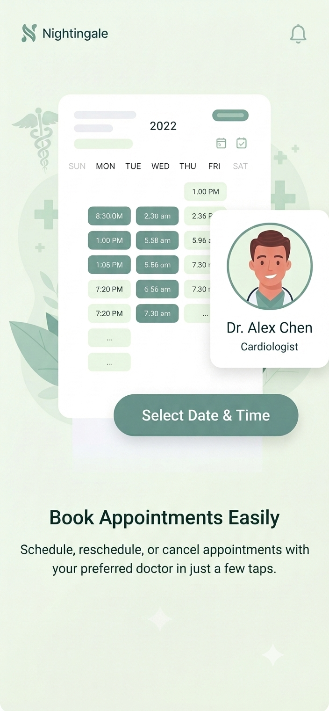 | 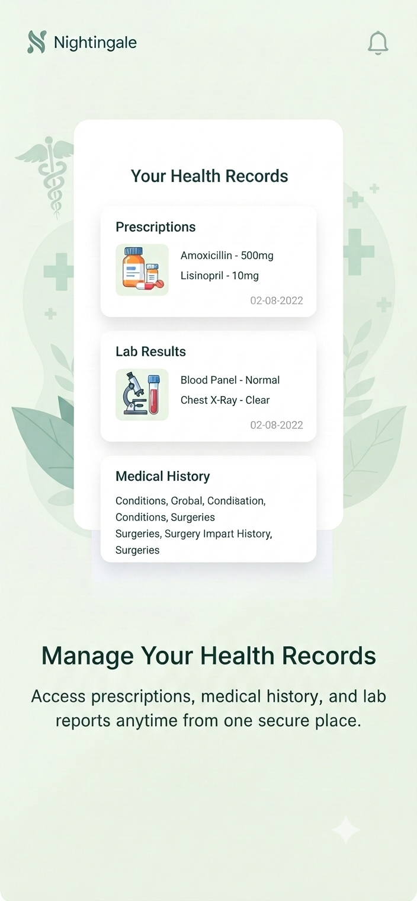 | 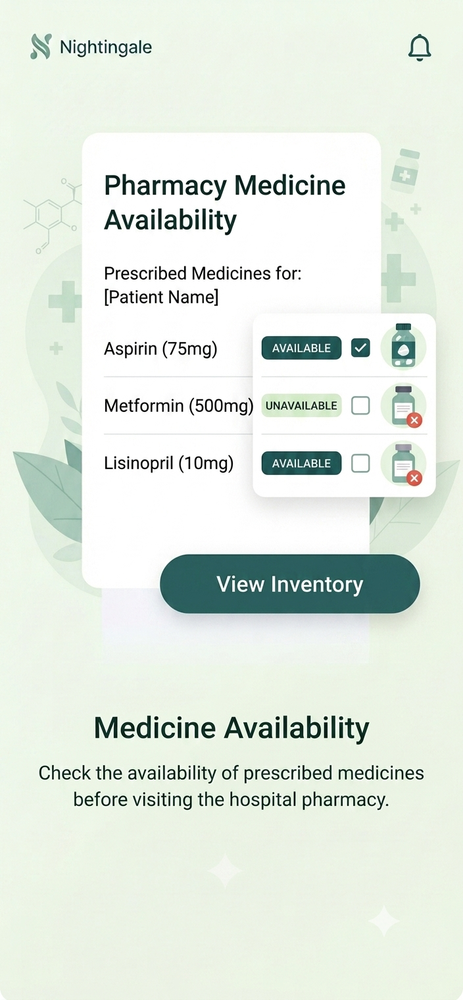 | 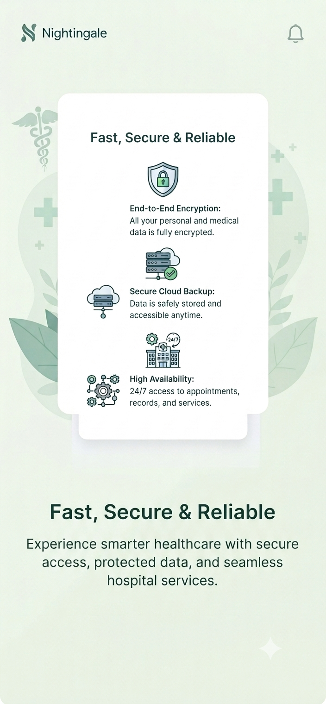 |

| Main Gateway | Login | Registration |
| :---: | :---: | :---: |
| 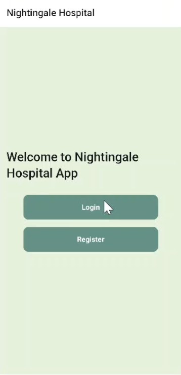 | 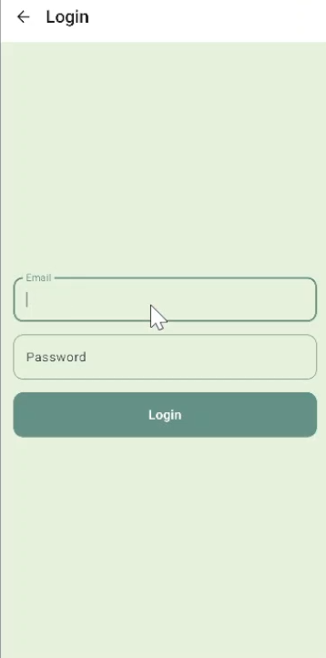 | 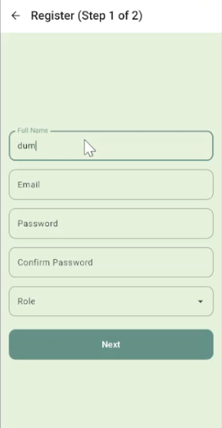 |

---

### 2. 🛡️ Administrator (Admin) Workflow
**Workflow Description**:
1. **System Control & Dashboard**: Log in to access central metrics, registered doctors/patients count, and bed occupancy summaries.
2. **Resource Management**: Create and track hospital beds across wards, set up operating theaters (OT), add diagnostic tests, and maintain department catalogs.
3. **Doctor Verification**: Review pending doctor registrations, verify credentials, assign departments, and approve doctor accounts.
4. **Admissions & Surgery Management**: Process patient hospital admissions by assigning available beds and schedule surgeries by assigning OTs, dates, and medical staff teams.
5. **Reports & Analytics**: Generate real-time reports monitoring lab test completions, active prescriptions, and facility utilization.

| Admin Dashboard | Resource Management | Reports & Analytics |
| :---: | :---: | :---: |
| 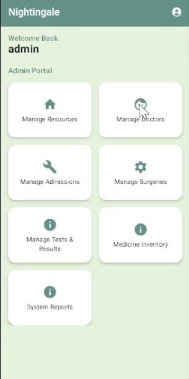 | 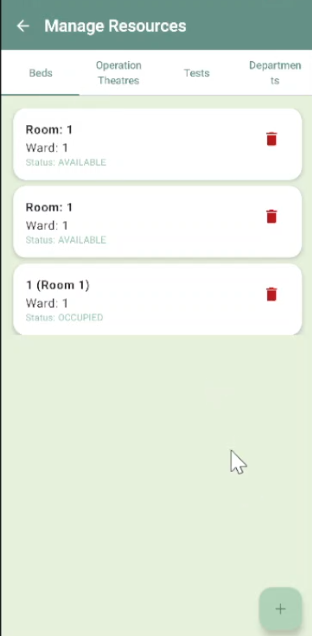 | 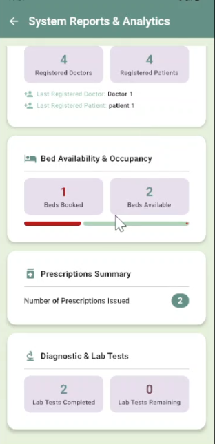 |

---

### 3. 🩺 Doctor Workflow
**Workflow Description**:
1. **Schedule & Availability Setup**: Define working hours, available appointment days, and time slots for patient bookings.
2. **Appointment Desk**: View incoming appointment requests, inspect patient details/notes, and accept, reject, or reschedule visits.
3. **Patient EMR Access**: View confirmed patient lists, access full medical histories, past diagnostic test results, and prior treatment records.
4. **Digital Prescriptions**: Write electronic prescriptions specifying medication dosages, duration, and instructions.
5. **Pharmacy Sync & Special Orders**: Check pharmacy inventory for medicine availability, request diagnostic lab tests, or order surgical operations.

| Doctor Dashboard | Confirmed Patients | Write Prescription |
| :---: | :---: | :---: |
| 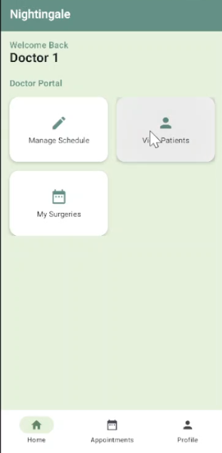 | 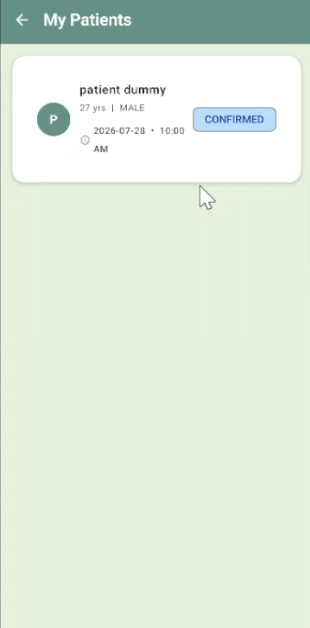 | 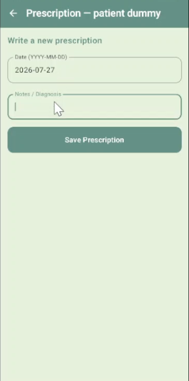 |

---

### 4. 👤 Patient Workflow
**Workflow Description**:
1. **Doctor Discovery & Appointment Booking**: Browse hospital departments, search for doctors, select an open consultation slot, enter symptoms/notes, and confirm the booking.
2. **Medicine Inventory Checker**: Search the hospital pharmacy stock to verify medicine availability and inventory counts.
3. **Digital Health Binder**: View issued digital prescriptions, check prescribed medicine dosages, and review diagnostic lab test results.
4. **Medical History Tracking**: Access full personal health history including past visits, completed lab tests, and booked surgeries.
5. **Real-time Notifications**: Receive instant alerts when appointments are accepted, prescriptions are issued, or lab results are published.

| Patient Dashboard | Book Appointment | Medical History & Records |
| :---: | :---: | :---: |
| 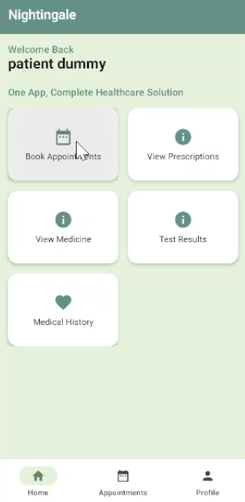 | 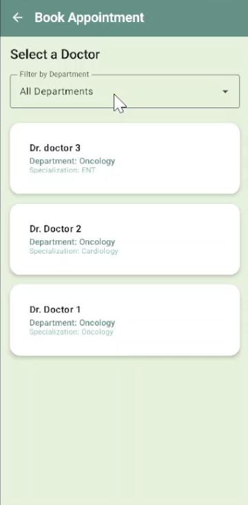 | 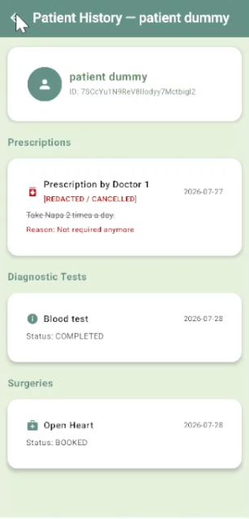 |

---

## 👥 Team Members (Group 8)

*   **Rantideb Roy** — `2022331023`
*   **Priya Rani Vokto** — `2022331051`
*   **Banasree Pramanik** — `2022331057`
*   **Supto Das** — `2022331059`
*   **Ankan Ghosh** — `2022331069`
*   **Md Maksudul Bahar Khan** — `2022331095`
